# SQL Cheat Sheet

## Complete Reference Guide for SQL Developers

This comprehensive cheat sheet documents commonly used SQL elements, from basic syntax to advanced concepts. Whether you're a beginner learning SQL or an experienced developer needing a quick reference, this guide has you covered.

---

## Table of Contents

1. [What is SQL?](#what-is-sql)
2. [SQL vs MySQL](#sql-vs-mysql)
3. [Installing MySQL](#installing-mysql)
4. [Using MySQL](#using-mysql)
5. [SQL Keywords Reference](#sql-keywords)
6. [Comments](#comments)
7. [MySQL Data Types](#mysql-data-types)
8. [Operators](#operators)
9. [Functions](#functions)
10. [Wildcard Characters](#wildcard-characters)
11. [Keys](#keys)
12. [Indexes](#indexes)
13. [Joins](#joins)
14. [Views](#views)

---

## What is SQL?

**SQL (Structured Query Language)** is the standard language for storing, manipulating, and retrieving data in relational databases. It powers the data behind most websites and applications you use daily.

### How a Relational Database Works

A relational database organizes data into tables that can be linked through relationships. Here's a visual representation of how tables interact:

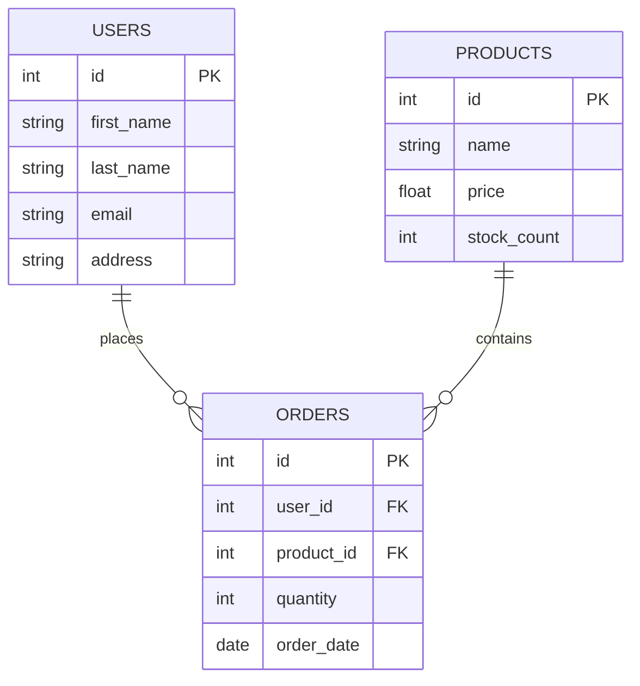

### Basic SQL Operations Flow

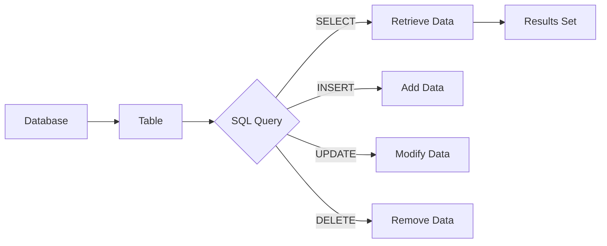

### Example Queries

**Selecting all data from a table:**
```sql
SELECT * FROM users;
```
This query retrieves every column and row from the `users` table, returning a results set like this:

| id | first_name | last_name | email | address |
|----|------------|-----------|-------|---------|
| 1 | John | Doe | john@email.com | 123 Main St |
| 2 | Jane | Smith | jane@email.com | 456 Oak Ave |

**Selecting specific columns:**
```sql
SELECT first_name, last_name FROM users;
```

**Filtering with conditions:**
```sql
SELECT * FROM products 
WHERE stock_count <= 10 
ORDER BY stock_count ASC;
```
This returns all products with low stock (10 or fewer), sorted from lowest to highest.

**Inserting new data:**
```sql
INSERT INTO users (first_name, last_name, address, email)
VALUES ('Tester', 'Jester', '123 Fake Street, Sheffield, United Kingdom', 'test@example.com');
```

---

## SQL vs MySQL

Understanding the distinction between SQL and MySQL is crucial:

| SQL | MySQL |
|-----|-------|
| **Language** - defines the syntax for querying databases | **Database System** - software that implements SQL |
| A standard used across database systems | One of many database management systems |
| Cannot be "installed" - it's a language specification | Can be installed on servers and local machines |

### Popular SQL Database Systems

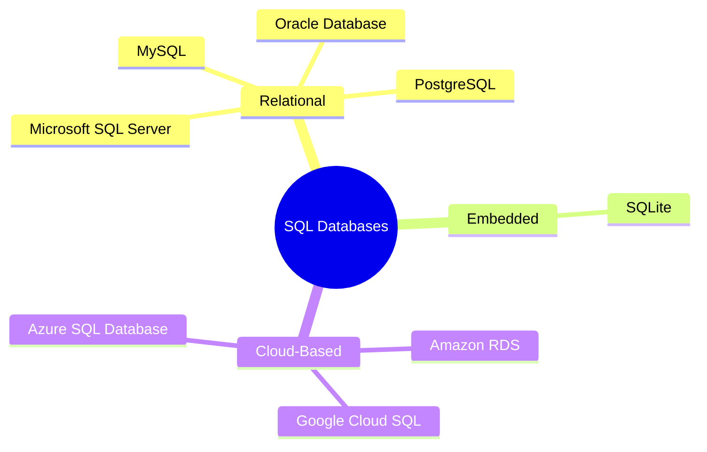

---

## Installing MySQL

### Windows Installation

The recommended method is using the official MySQL installer from the MySQL website. This provides a guided setup wizard that handles all configurations.

### macOS Installation

**Using Native Packages:**
Download the official MySQL installer for macOS from the MySQL website.

**Using Homebrew (Recommended for developers):**

For the latest version:
```bash
brew install mysql
```

For MySQL 5.7 (still widely used in production):
```bash
brew install mysql@5.7
```

---

## Using MySQL

Once MySQL is installed, use a database management application to interact with your databases efficiently.

### Recommended Management Tools

| Tool | Platform | Best For |
|------|----------|----------|
| **MySQL Workbench** | Windows/Mac/Linux | Official Oracle tool, comprehensive features |
| **HeidiSQL** | Windows | Lightweight, free, open-source |
| **Sequel Pro** | macOS | Clean interface, macOS native |
| **phpMyAdmin** | Web-based | Server management via browser |
| **DBeaver** | Cross-platform | Multi-database support |

### Practice with Sample Databases

MySQL provides free sample databases for learning:

**Example Query - Countries with Queen Elizabeth II as Head of State:**
```sql
SELECT name, continent, population 
FROM country 
WHERE head_of_state = 'Elisabeth II';
```

**Example Query - Large European Countries:**
```sql
SELECT country.name, city.name AS capital, city.population 
FROM country 
JOIN city ON country.capital = city.id 
WHERE country.continent = 'Europe' 
AND country.population > 50000000;
```

---

## SQL Keywords Reference

A comprehensive collection of SQL keywords with descriptions and practical examples.

### Data Definition Language (DDL)

| Keyword | Description | Example |
|---------|-------------|---------|
| **CREATE TABLE** | Creates a new table in the database | `CREATE TABLE users (id int, name varchar(255));` |
| **ALTER TABLE** | Modifies an existing table structure | `ALTER TABLE users ADD email varchar(255);` |
| **DROP TABLE** | Removes a table completely | `DROP TABLE users;` |
| **TRUNCATE TABLE** | Removes all data but keeps table structure | `TRUNCATE TABLE sessions;` |
| **CREATE DATABASE** | Creates a new database | `CREATE DATABASE websitesetup;` |
| **DROP DATABASE** | Removes a database entirely | `DROP DATABASE websitesetup;` |

#### Examples:

**Adding a column:**
```sql
ALTER TABLE users ADD email_address varchar(255);
```

**Adding a constraint:**
```sql
ALTER TABLE users ADD CONSTRAINT user PRIMARY KEY (id, surname);
```

**Adding and removing columns:**
```sql
-- Add a column
ALTER TABLE deals ADD approved boolean;

-- Remove a column
ALTER TABLE deals DROP COLUMN approved;
```

**Changing column data type:**
```sql
ALTER TABLE users ALTER COLUMN incept_date datetime;
```

### Data Manipulation Language (DML)

| Keyword | Description | Example |
|---------|-------------|---------|
| **SELECT** | Retrieves data from tables | `SELECT * FROM users;` |
| **INSERT INTO** | Adds new records | `INSERT INTO users VALUES (...);` |
| **UPDATE** | Modifies existing records | `UPDATE users SET name = 'John' WHERE id = 1;` |
| **DELETE** | Removes records | `DELETE FROM users WHERE id = 1;` |

#### Examples:

**Select with column filtering:**
```sql
SELECT first_name, surname FROM users;
```

**Insert with specific columns:**
```sql
INSERT INTO cars (make, model, mileage, year)
VALUES ('Audi', 'A3', 30000, 2016);
```

**Update specific records:**
```sql
UPDATE orders 
SET value = 19.49, quantity = 2 
WHERE id = 642;
```

**Update multiple columns:**
```sql
UPDATE cars 
SET mileage = 23500, serviceDue = 0 
WHERE id = 45;
```

**Delete specific records:**
```sql
DELETE FROM users WHERE user_id = 674;
```

### Query Clauses and Conditions

| Keyword | Description | Example |
|---------|-------------|---------|
| **WHERE** | Filters records based on conditions | `WHERE quantity > 1` |
| **ORDER BY** | Sorts results (ASC/DESC) | `ORDER BY name DESC` |
| **GROUP BY** | Groups rows for aggregation | `GROUP BY department` |
| **HAVING** | Filters grouped results | `HAVING COUNT(*) > 5` |
| **LIMIT/TOP** | Restricts number of results | `LIMIT 10` or `TOP 10` |

#### Examples:

**WHERE clause:**
```sql
SELECT * FROM orders WHERE quantity > 1;
```

**Multiple conditions with AND:**
```sql
SELECT * FROM events 
WHERE host_country = 'United Kingdom' 
AND host_city = 'London';
```

**OR condition:**
```sql
SELECT * FROM users 
WHERE city = 'Sheffield' OR city = 'Manchester';
```

**IN shorthand (replaces multiple OR):**
```sql
-- Instead of: WHERE country = 'USA' OR country = 'UK' OR country = 'Australia'
SELECT * FROM users 
WHERE country IN ('USA', 'United Kingdom', 'Australia');
```

**Sorting results:**
```sql
-- Ascending (A-Z, 1-10)
SELECT * FROM countries ORDER BY name ASC;

-- Descending (Z-A, 10-1)
SELECT * FROM products ORDER BY price DESC;
```

**Limiting results:**
```sql
-- Top N records
SELECT TOP 5 * FROM users;

-- With row number
SELECT * FROM countries WHERE ROWNUM <= 10;
```

### Advanced Query Keywords

| Keyword | Description | Example |
|---------|-------------|---------|
| **BETWEEN** | Selects values in a range | `WHERE price BETWEEN 10 AND 20` |
| **LIKE** | Pattern matching | `WHERE name LIKE 'J%'` |
| **IN** | Matches any value in a list | `WHERE country IN ('UK', 'US')` |
| **EXISTS** | Tests for record existence | `WHERE EXISTS (subquery)` |
| **ANY/ALL** | Compares with subquery values | `WHERE value > ANY (subquery)` |
| **CASE** | Conditional logic in queries | `CASE WHEN ... THEN ... END` |
| **DISTINCT** | Removes duplicate values | `SELECT DISTINCT country FROM users` |
| **UNION** | Combines result sets | `SELECT ... UNION SELECT ...` |

#### Examples:

**BETWEEN:**
```sql
-- Within range
SELECT * FROM stock WHERE quantity BETWEEN 100 AND 150;

-- Outside range
SELECT * FROM stock WHERE quantity NOT BETWEEN 100 AND 150;
```

**LIKE pattern matching:**
```sql
-- Ends with 'son'
SELECT * FROM users WHERE first_name LIKE '%son';

-- Contains 'son'
SELECT * FROM users WHERE first_name LIKE '%son%';
```

**ANY - compares against subquery:**
```sql
SELECT name FROM products 
WHERE productId = ANY (
  SELECT productId FROM orders WHERE quantity > 5
);
```

**ALL - must satisfy all subquery values:**
```sql
SELECT first_name, surname, tasks_no 
FROM users 
WHERE tasks_no > ALL (
  SELECT tasks FROM user WHERE department_id = 2
);
```

**CASE for conditional output:**
```sql
SELECT first_name, surname, subscriptions,
  CASE 
    WHEN subscriptions > 10 THEN 'Very active'
    WHEN subscriptions BETWEEN 3 AND 10 THEN 'Active'
    ELSE 'Inactive'
  END AS activity_levels
FROM users;
```

**UNION - combining results without duplicates:**
```sql
SELECT city FROM events
UNION
SELECT city FROM subscribers;
```

**UNION ALL - combining results with duplicates:**
```sql
SELECT city FROM events
UNION ALL
SELECT city FROM subscribers;
```

### Constraint Keywords

| Keyword | Description | Example |
|---------|-------------|---------|
| **PRIMARY KEY** | Unique identifier for records | `PRIMARY KEY (id)` |
| **FOREIGN KEY** | Links tables together | `FOREIGN KEY (user_id) REFERENCES users(id)` |
| **UNIQUE** | Ensures unique values | `UNIQUE (email)` |
| **CHECK** | Validates data conditions | `CHECK (age >= 18)` |
| **DEFAULT** | Sets default column value | `DEFAULT 'Unknown'` |
| **NOT NULL** | Prevents empty values | `name varchar(255) NOT NULL` |

#### Examples:

**CHECK constraint during table creation:**
```sql
CREATE TABLE users (
  first_name varchar(255),
  age int,
  CHECK (age >= 18)
);
```

**Adding CHECK to existing table:**
```sql
ALTER TABLE users ADD CHECK (age >= 18);
```

**UNIQUE constraint:**
```sql
-- During creation
CREATE TABLE users (
  id int NOT NULL,
  name varchar(255) NOT NULL,
  UNIQUE (id)
);

-- Adding later
ALTER TABLE users ADD UNIQUE (id);
```

**DEFAULT values:**
```sql
-- During creation
CREATE TABLE products (
  id int,
  name varchar(255) DEFAULT 'Placeholder Name',
  available_from date DEFAULT GETDATE()
);

-- Modifying existing table
ALTER TABLE products 
ALTER name SET DEFAULT 'Placeholder Name';
```

**Removing defaults:**
```sql
ALTER TABLE products ALTER COLUMN name DROP DEFAULT;
```

### NULL Handling

| Keyword | Description | Example |
|---------|-------------|---------|
| **IS NULL** | Tests for NULL values | `WHERE phone IS NULL` |
| **IS NOT NULL** | Tests for non-NULL values | `WHERE phone IS NOT NULL` |

```sql
-- Find users without contact numbers
SELECT * FROM users WHERE contact_number IS NULL;

-- Find users with contact numbers
SELECT * FROM users WHERE contact_number IS NOT NULL;
```

---

## Comments

Comments explain SQL code or temporarily prevent execution. SQL supports two comment styles.

### Comment Types Overview

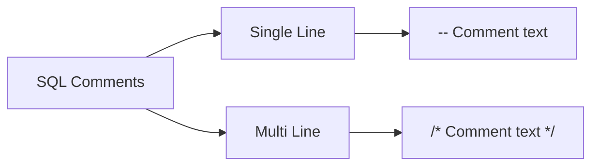

### Single-Line Comments

Start with `--`. Everything after these characters on the same line is ignored.

```sql
-- Retrieve all user records
SELECT * FROM users;

SELECT first_name, last_name FROM users; -- Only get names
```

### Multi-Line Comments

Start with `/*` and end with `*/`. Can span multiple lines.

```sql
/*
  This query retrieves all users
  who have placed orders in the
  last 30 days
*/
SELECT * FROM users 
WHERE last_order_date > '2024-01-01';

/*
  Temporarily disabled query
  SELECT * FROM tasks;
*/
```

---

## MySQL Data Types

When creating tables, each column requires a data type specification. This determines what kind of data can be stored and how it's handled.

### Data Type Categories

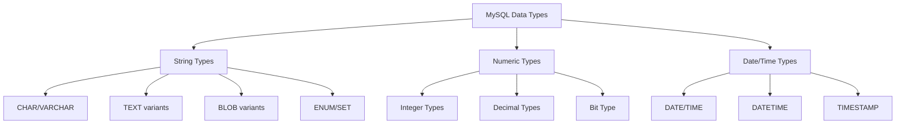

### String Data Types

| Data Type | Description | Max Size | Example |
|-----------|-------------|----------|---------|
| **CHAR(size)** | Fixed-length string | 255 chars | `CHAR(10)` - always 10 chars |
| **VARCHAR(size)** | Variable-length string | 65,535 chars | `VARCHAR(255)` - up to 255 chars |
| **TEXT(size)** | Long text strings | 65,535 bytes | `TEXT` - articles, descriptions |
| **TINYTEXT** | Very small text | 255 chars | Short notes |
| **MEDIUMTEXT** | Medium text | 16,777,215 chars | Books, large documents |
| **LONGTEXT** | Very large text | 4,294,967,295 chars | Full books, logs |
| **BLOB(size)** | Binary large objects | 65,535 bytes | Images, files (small) |
| **MEDIUMBLOB** | Medium binary | 16,777,215 bytes | Larger files |
| **LONGBLOB** | Very large binary | 4,294,967,295 bytes | Very large files |
| **ENUM(a,b,c...)** | Single value from list | 65,535 values | `ENUM('small','medium','large')` |
| **SET(a,b,c...)** | Multiple values from list | 64 values | `SET('red','green','blue')` |
| **BINARY(size)** | Fixed binary string | 255 bytes | Binary data |
| **VARBINARY(size)** | Variable binary | 65,535 bytes | Variable binary data |

#### String Type Examples:

```sql
-- CHAR vs VARCHAR
CREATE TABLE users (
  country_code CHAR(2),      -- Always 2 characters (US, UK, IN)
  full_name VARCHAR(100)      -- Variable length, up to 100
);

-- ENUM example (like radio buttons - single choice)
CREATE TABLE tshirts (
  color ENUM('red', 'green', 'blue', 'yellow', 'purple')
);

-- SET example (like checkboxes - multiple choices)
CREATE TABLE user_permissions (
  permissions SET('read', 'write', 'delete', 'admin')
);
```

### Numeric Data Types

| Data Type | Range (Signed) | Range (Unsigned) | Example |
|-----------|---------------|------------------|---------|
| **TINYINT** | -128 to 127 | 0 to 255 | Age (0-255) |
| **SMALLINT** | -32,768 to 32,767 | 0 to 65,535 | Year, count |
| **MEDIUMINT** | -8,388,608 to 8,388,607 | 0 to 16,777,215 | Medium counts |
| **INT/INTEGER** | -2.14B to 2.14B | 0 to 4.29B | IDs, quantities |
| **BIGINT** | -9.22 quintillion to 9.22 quintillion | 0 to 18.44 quintillion | Very large numbers |
| **FLOAT(p)** | Variable precision | Variable precision | Scientific data |
| **DOUBLE** | Higher precision | Higher precision | Financial calculations |
| **DECIMAL(size,d)** | Exact fixed point | Exact fixed point | Money (DECIMAL(10,2)) |
| **BIT(size)** | Bit value (1-64 bits) | N/A | Boolean, flags |
| **BOOL/BOOLEAN** | 0 (false) or 1 (true) | N/A | Yes/No flags |

#### Numeric Type Examples:

```sql
-- Integer types
CREATE TABLE products (
  id INT AUTO_INCREMENT,
  quantity SMALLINT,
  views BIGINT
);

-- Decimal for precise calculations
CREATE TABLE orders (
  id INT,
  amount DECIMAL(10,2),    -- 10 digits total, 2 after decimal
  tax_rate DECIMAL(4,2)     -- 4 digits total, 2 after decimal (99.99%)
);

-- Boolean
CREATE TABLE users (
  is_active BOOLEAN,        -- Stored as TINYINT(1)
  is_verified BOOL          -- Same as BOOLEAN
);
```

### Date and Time Data Types

| Data Type | Format | Range | Example |
|-----------|--------|-------|---------|
| **DATE** | YYYY-MM-DD | 1000-01-01 to 9999-12-31 | `'2024-03-15'` |
| **DATETIME** | YYYY-MM-DD HH:MM:SS | 1000-01-01 to 9999-12-31 | `'2024-03-15 14:30:00'` |
| **TIMESTAMP** | Unix timestamp | 1970-01-01 to 2038-01-19 | Auto-updated |
| **TIME** | HH:MM:SS | -838:59:59 to 838:59:59 | `'14:30:00'` |
| **YEAR** | YYYY | 1901 to 2155 | `2024` |

#### Date/Time Type Examples:

```sql
-- Creating tables with date types
CREATE TABLE events (
  event_date DATE,
  event_datetime DATETIME,
  created_at TIMESTAMP DEFAULT CURRENT_TIMESTAMP,
  event_time TIME,
  event_year YEAR
);

-- Auto-updating timestamp
CREATE TABLE logs (
  id INT,
  message TEXT,
  created_at TIMESTAMP DEFAULT CURRENT_TIMESTAMP,
  updated_at TIMESTAMP DEFAULT CURRENT_TIMESTAMP ON UPDATE CURRENT_TIMESTAMP
);
```

---

## Operators

SQL operators perform operations on data values.

### Operator Categories

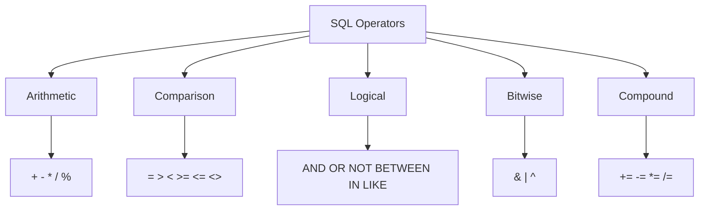

### Arithmetic Operators

Perform mathematical calculations.

```sql
-- Basic arithmetic
SELECT price + tax AS total_price FROM products;
SELECT salary - deductions AS net_pay FROM employees;
SELECT quantity * price AS line_total FROM orders;
SELECT total_amount / quantity AS unit_price FROM orders;
SELECT number % 2 AS is_even FROM numbers;  -- 0 = even, 1 = odd
```

| Operator | Description | Example |
|----------|-------------|---------|
| **+** | Addition | `SELECT 10 + 5;` → 15 |
| **-** | Subtraction | `SELECT 10 - 5;` → 5 |
| ***** | Multiplication | `SELECT 10 * 5;` → 50 |
| **/** | Division | `SELECT 10 / 5;` → 2 |
| **%** | Modulo (remainder) | `SELECT 10 % 3;` → 1 |

### Comparison Operators

Compare values and return TRUE, FALSE, or NULL.

```sql
-- Comparison examples
SELECT * FROM products WHERE price = 100;
SELECT * FROM products WHERE price > 50;
SELECT * FROM products WHERE quantity < 10;
SELECT * FROM users WHERE age >= 18;
SELECT * FROM orders WHERE amount <= 1000;
SELECT * FROM users WHERE email <> 'spam@example.com';
```

| Operator | Description | Example |
|----------|-------------|---------|
| **=** | Equal to | `WHERE id = 5` |
| **>** | Greater than | `WHERE age > 21` |
| **<** | Less than | `WHERE price < 100` |
| **>=** | Greater or equal | `WHERE quantity >= 10` |
| **<=** | Less or equal | `WHERE rating <= 5` |
| **<>** | Not equal to | `WHERE status <> 'cancelled'` |

### Bitwise Operators

Perform operations on bit patterns.

```sql
-- Bitwise operations
SELECT 5 & 3;   -- 1 (0101 & 0011 = 0001)
SELECT 5 | 3;   -- 7 (0101 | 0011 = 0111)
SELECT 5 ^ 3;   -- 6 (0101 ^ 0011 = 0110)
```

| Operator | Description | Example |
|----------|-------------|---------|
| **&** | Bitwise AND | `SELECT 5 & 3;` → 1 |
| **\|** | Bitwise OR | `SELECT 5 \| 3;` → 7 |
| **^** | Bitwise XOR | `SELECT 5 ^ 3;` → 6 |

### Compound Operators

Shorthand for performing an operation and assignment.

```sql
-- Compound operations (used in UPDATE)
UPDATE orders SET quantity += 1 WHERE id = 100;    -- Increment
UPDATE products SET price -= 5 WHERE category = 'sale';
UPDATE line_items SET total *= 1.1;                -- Add 10%
UPDATE totals SET average /= 2;
```

| Operator | Description |
|----------|-------------|
| **+=** | Add and assign |
| **-=** | Subtract and assign |
| ***=** | Multiply and assign |
| **/=** | Divide and assign |
| **%=** | Modulo and assign |

---

## Functions

SQL functions perform operations on data and return results.

### Function Categories

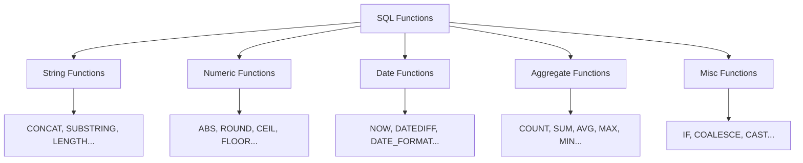

### String Functions

Manipulate and analyze text data.

| Function | Description | Example |
|----------|-------------|---------|
| **CONCAT(s1,s2,...)** | Joins strings together | `CONCAT('Hello',' World')` → 'Hello World' |
| **UPPER(s)** | Converts to uppercase | `UPPER('hello')` → 'HELLO' |
| **LOWER(s)** | Converts to lowercase | `LOWER('HELLO')` → 'hello' |
| **LENGTH(s)** | Returns string length in bytes | `LENGTH('hello')` → 5 |
| **SUBSTRING(s,start,len)** | Extracts part of string | `SUBSTRING('hello',1,2)` → 'he' |
| **TRIM(s)** | Removes leading/trailing spaces | `TRIM(' hello ')` → 'hello' |
| **REPLACE(s,old,new)** | Replaces substring | `REPLACE('hello','l','L')` → 'heLLo' |
| **LEFT(s,n)** | Returns n chars from left | `LEFT('hello',2)` → 'he' |
| **RIGHT(s,n)** | Returns n chars from right | `RIGHT('hello',2)` → 'lo' |
| **REVERSE(s)** | Reverses string | `REVERSE('hello')` → 'olleh' |

#### String Function Examples:

```sql
-- Concatenation
SELECT CONCAT(first_name, ' ', last_name) AS full_name FROM users;

-- Pattern search position
SELECT INSTR('hello world', 'world');  -- Returns 7

-- Case conversion
SELECT UPPER(first_name), LOWER(last_name) FROM users;

-- Padding
SELECT LPAD('123', 5, '0');   -- '00123'
SELECT RPAD('123', 5, '0');   -- '12300'

-- Space removal
SELECT LTRIM('   hello');     -- 'hello' (left spaces removed)
SELECT RTRIM('hello   ');     -- 'hello' (right spaces removed)
SELECT TRIM('  hello  ');     -- 'hello' (both sides)

-- Substring extraction
SELECT SUBSTRING('Hello World', 7, 5);  -- 'World'
```

### Numeric Functions

Perform mathematical operations.

| Function | Description | Example |
|----------|-------------|---------|
| **ABS(n)** | Absolute value | `ABS(-5)` → 5 |
| **ROUND(n,d)** | Round to d decimals | `ROUND(3.14159,2)` → 3.14 |
| **CEIL(n)** | Round up to integer | `CEIL(3.1)` → 4 |
| **FLOOR(n)** | Round down to integer | `FLOOR(3.9)` → 3 |
| **MOD(n,m)** | Remainder of n/m | `MOD(10,3)` → 1 |
| **POWER(n,m)** | n raised to power m | `POWER(2,3)` → 8 |
| **SQRT(n)** | Square root | `SQRT(16)` → 4 |
| **RAND()** | Random number 0-1 | `RAND()` → 0.1234... |
| **PI()** | Returns π | `PI()` → 3.141592... |

#### Numeric Function Examples:

```sql
-- Rounding
SELECT ROUND(price, 2) FROM products;
SELECT CEIL(4.2);        -- 5
SELECT FLOOR(4.8);       -- 4

-- Power and root
SELECT POWER(2, 10);     -- 1024
SELECT SQRT(144);        -- 12

-- Random
SELECT RAND();           -- Random between 0 and 1
SELECT FLOOR(RAND() * 100);  -- Random integer 0-99

-- Math constants
SELECT PI();             -- 3.14159265358979
```

### Aggregate Functions

Perform calculations on sets of rows.

| Function | Description | Example |
|----------|-------------|---------|
| **COUNT(*)** | Counts rows | `COUNT(*)` → total records |
| **SUM(col)** | Sums values | `SUM(amount)` → total |
| **AVG(col)** | Averages values | `AVG(price)` → average |
| **MAX(col)** | Highest value | `MAX(salary)` → highest |
| **MIN(col)** | Lowest value | `MIN(price)` → lowest |

#### Aggregate Function Examples:

```sql
-- Count records
SELECT COUNT(*) AS total_users FROM users;
SELECT COUNT(DISTINCT country) FROM users;

-- Sum and average
SELECT SUM(amount) AS total_revenue FROM orders;
SELECT AVG(rating) AS avg_rating FROM reviews;

-- Min and max
SELECT MIN(price) AS cheapest, MAX(price) AS most_expensive 
FROM products;

-- Grouping aggregates
SELECT category, COUNT(*) AS count, AVG(price) AS avg_price
FROM products
GROUP BY category;
```

### Date and Time Functions

| Function | Description | Example |
|----------|-------------|---------|
| **NOW()** | Current date and time | `NOW()` → '2024-03-15 14:30:00' |
| **CURDATE()** | Current date | `CURDATE()` → '2024-03-15' |
| **CURTIME()** | Current time | `CURTIME()` → '14:30:00' |
| **DATE(datetime)** | Extracts date part | `DATE('2024-03-15 14:30:00')` → '2024-03-15' |
| **YEAR(date)** | Extracts year | `YEAR('2024-03-15')` → 2024 |
| **MONTH(date)** | Extracts month | `MONTH('2024-03-15')` → 3 |
| **DAY(date)** | Extracts day | `DAY('2024-03-15')` → 15 |
| **DATEDIFF(d1,d2)** | Days between dates | `DATEDIFF('2024-03-15','2024-03-01')` → 14 |
| **DATE_ADD(d, INTERVAL)** | Add to date | `DATE_ADD('2024-03-15', INTERVAL 7 DAY)` |

#### Date Function Examples:

```sql
-- Current date/time
SELECT NOW();              -- 2024-03-15 14:30:00
SELECT CURDATE();          -- 2024-03-15
SELECT CURTIME();          -- 14:30:00

-- Extract parts
SELECT YEAR(order_date) FROM orders;
SELECT MONTHNAME(order_date) FROM orders;  -- 'March'

-- Date arithmetic
SELECT DATEDIFF('2024-12-31', '2024-01-01');  -- 365

-- Add/subtract intervals
SELECT DATE_ADD('2024-03-15', INTERVAL 30 DAY);
SELECT DATE_SUB('2024-03-15', INTERVAL 1 MONTH);

-- Format dates
SELECT DATE_FORMAT('2024-03-15', '%M %d, %Y');  -- 'March 15, 2024'
```

### Miscellaneous Functions

| Function | Description | Example |
|----------|-------------|---------|
| **IF(cond,val1,val2)** | Conditional value | `IF(age>=18,'Adult','Minor')` |
| **COALESCE(val1,val2,...)** | First non-null value | `COALESCE(phone,'N/A')` |
| **CAST(val AS type)** | Convert data type | `CAST('123' AS UNSIGNED)` |
| **DATABASE()** | Current database name | `DATABASE()` → 'mydb' |
| **VERSION()** | MySQL version | `VERSION()` → '8.0.36' |

#### Miscellaneous Function Examples:

```sql
-- IF function
SELECT IF(price > 100, 'Expensive', 'Affordable') FROM products;

-- Handle NULL values
SELECT COALESCE(phone, email, 'No contact') FROM users;

-- Type conversion
SELECT CAST('2024-03-15' AS DATE);
SELECT CONVERT('123', SIGNED INTEGER);

-- System information
SELECT DATABASE();
SELECT VERSION();
SELECT CURRENT_USER();
```

---

## Wildcard Characters

Wildcards enable powerful pattern matching with the LIKE operator.

### Wildcard Pattern Matching Flow

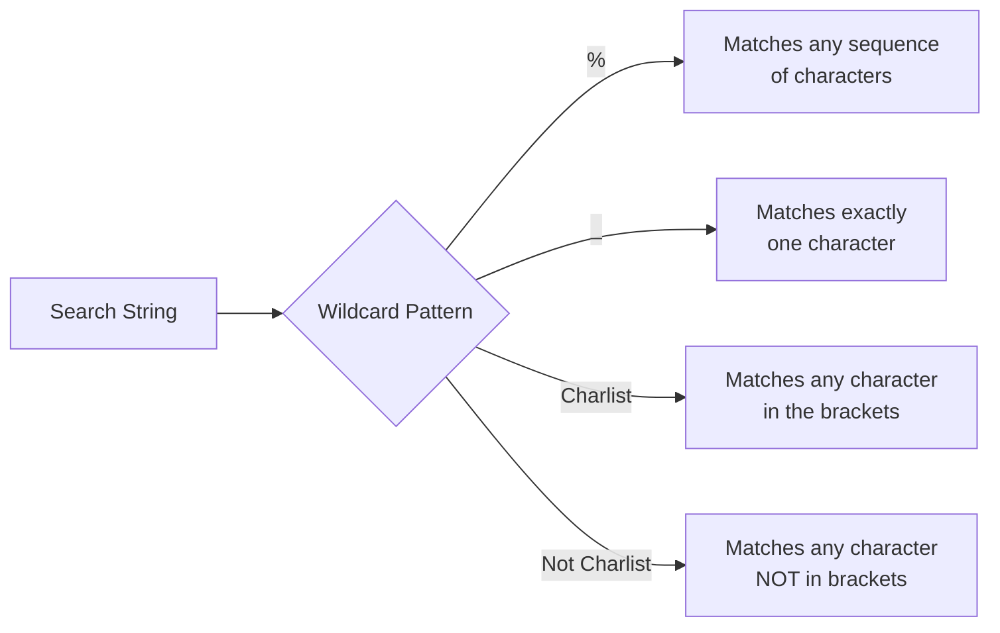

### Wildcard Characters

| Wildcard | Description | Example Pattern | Matches |
|----------|-------------|-----------------|---------|
| **%** | Zero or more characters | `'a%'` | Starts with 'a' |
| **_ (underscore)** | Exactly one character | `'_at'` | 'cat', 'hat', 'bat' |
| **[chars]** | Any single char in list | `'[abc]%'` | Starts with a, b, or c |
| **[!chars]** | Any single char NOT in list | `'[!abc]%'` | Doesn't start with a, b, or c |
| **[a-z]** | Any char in range | `'[a-z]%'` | Starts with lowercase letter |

#### Wildcard Examples:

**Using % (percent):**
```sql
-- Names ending with 'son'
SELECT * FROM users WHERE surname LIKE '%son';
-- Matches: Johnson, Richardson, Wilson

-- Names containing 'che'
SELECT * FROM users WHERE city LIKE '%che%';
-- Matches: Manchester, Rochester, Chelmsford
```

**Using _ (underscore):**
```sql
-- Cities with exactly 3 chars followed by 'chester'
SELECT * FROM users WHERE city LIKE '___chester';
-- Matches: Manchester, Winchester
-- Doesn't match: Rochester (only 2 chars before 'chester')
```

**Using [charlist]:**
```sql
-- Names starting with J, H, or M
SELECT * FROM users WHERE first_name LIKE '[jhm]%';
-- Matches: John, Henry, Mary

-- Names starting with A through L
SELECT * FROM users WHERE first_name LIKE '[a-l]%';
-- Matches: Alice, Bob, Carol
-- Doesn't match: Mary, Nancy, Zara

-- Names NOT ending with n through s
SELECT * FROM users WHERE first_name LIKE '%[!n-s]';
-- Matches: Robert, Alice
-- Doesn't match: John, Carlos, James
```

---

## Keys

Keys establish relationships between tables and ensure data integrity.

### Key Relationships

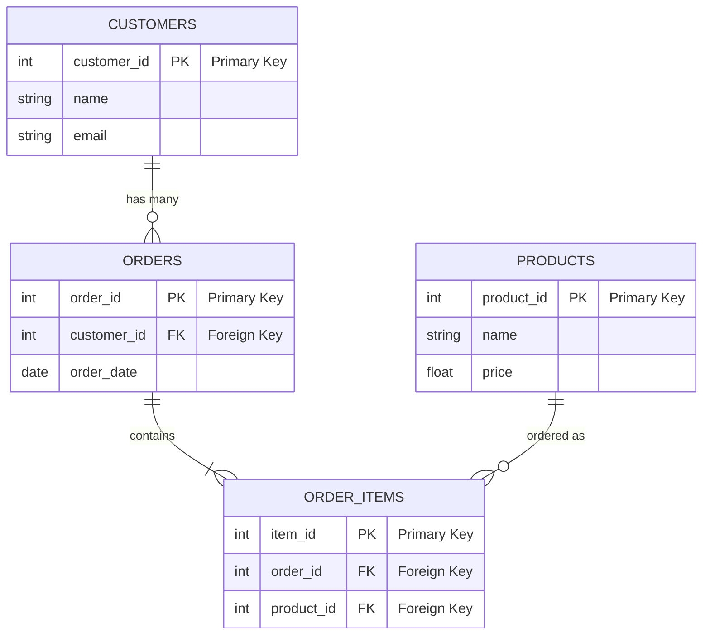

### Primary Key

A primary key uniquely identifies each record in a table. Each table can have only ONE primary key.

**Creating a primary key during table creation:**
```sql
CREATE TABLE users (
  id INT NOT NULL AUTO_INCREMENT,
  first_name VARCHAR(255),
  last_name VARCHAR(255) NOT NULL,
  address VARCHAR(255),
  email VARCHAR(255),
  PRIMARY KEY (id)
);
```

**Adding primary key to existing table:**
```sql
ALTER TABLE users ADD PRIMARY KEY (first_name);
```

**Composite primary key (multiple columns):**
```sql
ALTER TABLE users ADD CONSTRAINT user PRIMARY KEY (id, surname);
```

### Foreign Key

A foreign key links two tables together, creating a parent-child relationship.

**Creating foreign keys during table creation:**
```sql
CREATE TABLE orders (
  id INT NOT NULL,
  user_id INT,
  product_id INT,
  PRIMARY KEY (id),
  FOREIGN KEY (user_id) REFERENCES users(id),
  FOREIGN KEY (product_id) REFERENCES products(id)
);
```

**Adding foreign key to existing table:**
```sql
ALTER TABLE orders ADD FOREIGN KEY (user_id) REFERENCES users(id);
```

---

## Indexes

Indexes speed up data retrieval for frequently searched columns. However, they slow down data insertion and updates because the index must be updated too.

### Index Types

| Index Type | Description | When to Use |
|------------|-------------|-------------|
| **Regular Index** | Speeds up searches, allows duplicates | Frequently searched columns |
| **Unique Index** | Speeds up searches, prevents duplicates | Email, username columns |
| **Composite Index** | Index on multiple columns | Columns often queried together |
| **Primary Key Index** | Automatically created for primary keys | Always exists on PK column |

### Creating Indexes

**Standard Index (allows duplicates):**
```sql
CREATE INDEX idx_lastname ON users (last_name);

-- Composite index
CREATE INDEX idx_name ON users (first_name, surname);
```

**Unique Index (prevents duplicates):**
```sql
CREATE UNIQUE INDEX idx_email ON users (email);
```

### Dropping Indexes

```sql
ALTER TABLE users DROP INDEX idx_lastname;
```

---

## Joins

JOIN clauses combine data from multiple tables based on related columns.

### Join Types Visualization

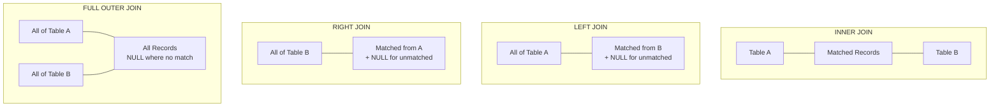

### Join Types

| Join Type | Returns | Visual |
|-----------|---------|--------|
| **INNER JOIN** | Only matching records from both tables | Intersection of two sets |
| **LEFT JOIN** | All records from left table + matching from right | Complete left circle |
| **RIGHT JOIN** | All records from right table + matching from left | Complete right circle |
| **FULL OUTER JOIN** | All records from both tables | Both complete circles |
| **CROSS JOIN** | Every combination of rows | Cartesian product |

### Practical Join Example

Consider three tables: `orders`, `users`, and `products`.

**Query joining three tables:**
```sql
SELECT 
  orders.id,
  users.first_name, 
  users.surname, 
  products.name AS 'product name'
FROM orders
INNER JOIN users ON orders.user_id = users.id
INNER JOIN products ON orders.product_id = products.id;
```

**Result set:**
| id | first_name | surname | product name |
|----|------------|---------|--------------|
| 1 | John | Doe | Laptop |
| 2 | Jane | Smith | Mouse |
| 3 | Bob | Wilson | Keyboard |

### Additional Join Examples

**LEFT JOIN - All users with their orders (if any):**
```sql
SELECT users.name, orders.id AS order_id
FROM users
LEFT JOIN orders ON users.id = orders.user_id;
```
Returns all users, showing NULL for order_id if they haven't ordered.

**Self Join - Employees and their managers:**
```sql
SELECT 
  e.name AS employee,
  m.name AS manager
FROM employees e
LEFT JOIN employees m ON e.manager_id = m.id;
```

---

## Views

A view is a saved SQL query stored under a label in the database. It acts as a virtual table that you can query later without re-running the original query.

### How Views Work

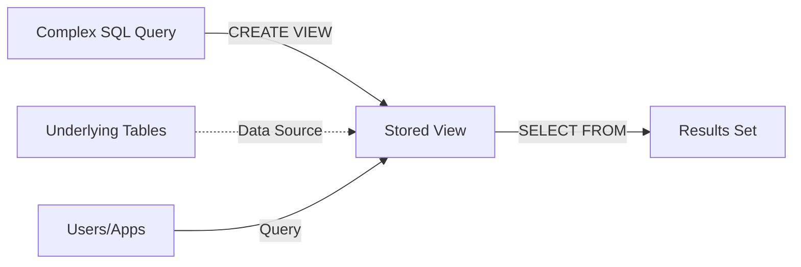

### Creating Views

```sql
CREATE VIEW priority_users AS
SELECT * FROM users
WHERE country = 'United Kingdom';
```

**Using the view:**
```sql
SELECT * FROM [priority_users];
```

### Modifying Views

**Update an existing view:**
```sql
CREATE OR REPLACE VIEW [priority_users] AS
SELECT * FROM users
WHERE country = 'United Kingdom' 
   OR country = 'USA';
```

### Deleting Views

```sql
DROP VIEW priority_users;
```

### View Benefits

| Benefit | Description |
|---------|-------------|
| **Performance** | Store expensive queries once, reuse results |
| **Security** | Expose only specific columns to users |
| **Simplicity** | Simplify complex queries for end users |
| **Consistency** | Ensure consistent query logic across applications |

---

## Quick Reference Cards

### Essential SELECT Query Structure

```sql
SELECT [DISTINCT] column1, column2, ...
FROM table_name
[JOIN other_table ON condition]
[WHERE condition]
[GROUP BY column]
[HAVING group_condition]
[ORDER BY column [ASC|DESC]]
[LIMIT count];
```

### CRUD Operations Summary

| Operation | Command | Example |
|-----------|---------|---------|
| **Create** | INSERT INTO | `INSERT INTO users VALUES (...);` |
| **Read** | SELECT | `SELECT * FROM users;` |
| **Update** | UPDATE | `UPDATE users SET name='X' WHERE id=1;` |
| **Delete** | DELETE | `DELETE FROM users WHERE id=1;` |

---

*This cheat sheet serves as a comprehensive reference for SQL development. Bookmark it for quick access during your database work.*
